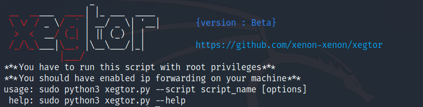

# xegtor

xegtor is a tool for performing network attacks.

Screenshots
----

Installation
----
    git clone https://github.com/xenon-xenon/xegtor.git
    
    pip3 install -r requirements.txt
    
Usage
----
    sudo python3 xegtor.py -h
    
Scripts
----
`ARP Cache Poisoning`  ---> acp.py

Contribution
----
I will be happy if anyone contributes in this project :smile: